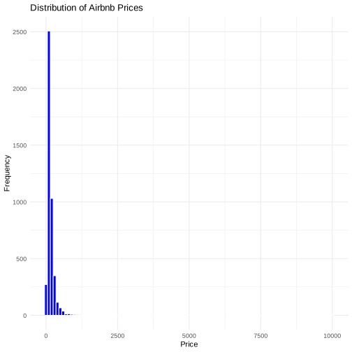
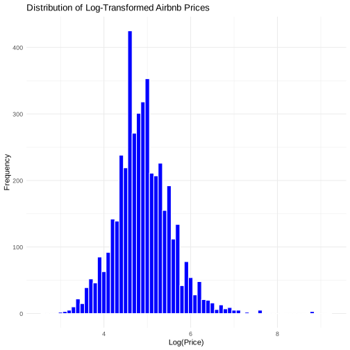

## Vancouver AirBnB Listing Price Logistic regression Prediction

Analyze AirBnB listing prices in Vancouver, BC (variable price). Here we will work with several sorts of categorical variables, including those that contain way too many too small categories. Also, we will do log-transforms to interpret the results, and do some predictions.

The variables of
price listing:

-price in the form “$1,234” (note: character string)


-bedrooms
number of bedrooms

-room_type type of listing (a shared room, whole unit, ...)


-accommodates accommodates how many people?


set up 


```R
library("tidyverse")

```

1. Load the data, find the nas in each column
2. remove entries with missing or invalid price, bedrooms
3. only select price, bedrooms,room_type, accommodates


```R
airbnb <- read.csv("airbnb-vancouver-bc-listings.csv.bz2")
airbnb1<-airbnb %>%
  select(price, bedrooms,room_type, accommodates)
head(colSums(is.na(airbnb)))
```


<style>
.dl-inline {width: auto; margin:0; padding: 0}
.dl-inline>dt, .dl-inline>dd {float: none; width: auto; display: inline-block}
.dl-inline>dt::after {content: ":\0020"; padding-right: .5ex}
.dl-inline>dt:not(:first-of-type) {padding-left: .5ex}
</style><dl class=dl-inline><dt>id</dt><dd>0</dd><dt>listing_url</dt><dd>0</dd><dt>scrape_id</dt><dd>0</dd><dt>last_scraped</dt><dd>0</dd><dt>name</dt><dd>0</dd><dt>description</dt><dd>0</dd></dl>


convert the price into numeric and replace the NAs in bedrooms with 0 bedrooms.


```R
airbnb1<-airbnb %>%
  select(price, bedrooms,room_type, accommodates)%>%
  mutate(
    price = as.numeric(str_replace_all(price, "[^0-9.]", "")), 
    bedrooms = ifelse(is.na(bedrooms), 0, bedrooms))
```

# Check the data and do log transformation 
When analyzing the distribution of price. As the chart shows below, there is a well-defined lower bound but no obvious upper bound. The corresponding distributions tend not to look normal but are more similar to log-normal. I think it is better to do a log transformation to make it more similar to normal distribution.
Also, log transformation improves the predictive power of the model (increases R2)
Therefore, I would suggest to do a log transformation.


```R
ggplot(airbnb1, aes(x = price)) +
  geom_histogram(binwidth = 100, fill = "blue", color = "white") +
  labs(title = "Distribution of Airbnb Prices", x = "Price", y = "Frequency") +
  theme_minimal()

ggplot(airbnb1, aes(x = log(price))) +
  geom_histogram(binwidth = 0.1, fill = "blue", color = "white") +
  labs(title = "Distribution of Log-Transformed Airbnb Prices", x = "Log(Price)", y = "Frequency") +
  theme_minimal()
```


    

    


    

    


#  Convert some variables into categorical variables

Convert the number of bedrooms into another variable with a limited number of categories only, such as 0, 1, 2, 3+, and use these categories in the models below. Add new column named bedrooms_category.


```R
airbnb1 <- airbnb1 %>%
  mutate(
    bedrooms_category = cut(
      bedrooms,
      breaks = c(0, 1, 2, 3, Inf),  
      labels = c("0", "1", "2", "3+"),
      include.lowest = TRUE,
      right = FALSE
    )
  )
```

# Estimate a regression model 

Estimate a linear regression model to explain log price with number of bedrooms (use the bedroom categories above).

We can found that model1 using log(price) transformation R2=30%
while model without using lig transformation has R2=8%
Apparently, "model1" using log(price) has higher R2 than "model" using price. Therefore, we can prove that doing the log transformation does help us get to a better model.


```R
model<- lm(price ~ bedrooms_category, data = airbnb1)
summary(model)

model1 <- lm(log(price) ~ bedrooms_category, data = airbnb1)
summary(model1)

model2 <- lm(log(price) ~ bedrooms_category+room_type+accommodates, data = airbnb1)
summary(model2)
```


    
    Call:
    lm(formula = price ~ bedrooms_category, data = airbnb1)
    
    Residuals:
       Min     1Q Median     3Q    Max 
    -365.6  -63.7  -27.5   23.5 9872.5 
    
    Coefficients:
                        Estimate Std. Error t value Pr(>|t|)    
    (Intercept)           142.75      15.71   9.087  < 2e-16 ***
    bedrooms_category1    -16.20      16.68  -0.971  0.33164    
    bedrooms_category2     51.32      17.71   2.897  0.00378 ** 
    bedrooms_category3+   247.84      19.69  12.585  < 2e-16 ***
    ---
    Signif. codes:  0 ‘***’ 0.001 ‘**’ 0.01 ‘*’ 0.05 ‘.’ 0.1 ‘ ’ 1
    
    Residual standard error: 277.5 on 4444 degrees of freedom
    Multiple R-squared:  0.08508,	Adjusted R-squared:  0.08446 
    F-statistic: 137.7 on 3 and 4444 DF,  p-value: < 2.2e-16


    
    Call:
    lm(formula = log(price) ~ bedrooms_category, data = airbnb1)
    
    Residuals:
        Min      1Q  Median      3Q     Max 
    -2.4411 -0.3292 -0.0415  0.3315  4.5636 
    
    Coefficients:
                        Estimate Std. Error t value Pr(>|t|)    
    (Intercept)          4.72903    0.03085 153.281   <2e-16 ***
    bedrooms_category1  -0.08235    0.03277  -2.513    0.012 *  
    bedrooms_category2   0.42656    0.03479  12.262   <2e-16 ***
    bedrooms_category3+  0.93094    0.03868  24.071   <2e-16 ***
    ---
    Signif. codes:  0 ‘***’ 0.001 ‘**’ 0.01 ‘*’ 0.05 ‘.’ 0.1 ‘ ’ 1
    
    Residual standard error: 0.545 on 4444 degrees of freedom
    Multiple R-squared:  0.2964,	Adjusted R-squared:  0.2959 
    F-statistic: 623.9 on 3 and 4444 DF,  p-value: < 2.2e-16


    
    Call:
    lm(formula = log(price) ~ bedrooms_category + room_type + accommodates, 
        data = airbnb1)
    
    Residuals:
        Min      1Q  Median      3Q     Max 
    -3.1677 -0.2971 -0.0458  0.2708  4.9091 
    
    Coefficients:
                           Estimate Std. Error t value Pr(>|t|)    
    (Intercept)            4.501236   0.031572 142.568  < 2e-16 ***
    bedrooms_category1     0.007594   0.029850   0.254  0.79920    
    bedrooms_category2     0.173568   0.033704   5.150 2.72e-07 ***
    bedrooms_category3+    0.384084   0.044729   8.587  < 2e-16 ***
    room_typeHotel room    0.317667   0.245144   1.296  0.19510    
    room_typePrivate room -0.438606   0.020523 -21.371  < 2e-16 ***
    room_typeShared room  -0.457370   0.173745  -2.632  0.00851 ** 
    accommodates           0.115479   0.006328  18.248  < 2e-16 ***
    ---
    Signif. codes:  0 ‘***’ 0.001 ‘**’ 0.01 ‘*’ 0.05 ‘.’ 0.1 ‘ ’ 1
    
    Residual standard error: 0.4897 on 4440 degrees of freedom
    Multiple R-squared:  0.4324,	Adjusted R-squared:  0.4315 
    F-statistic: 483.3 on 7 and 4440 DF,  p-value: < 2.2e-16


Now we include two further variables into the model: room type and accommodates.
Accommodates here means how many people can live in the airbnb, we can see that most airbnb can accommodate 2 people
room type here can be categorized in to four categories, Entire home/apt, Hotel room, Private room and shared room. Most of the airbnb are entire home. 


```R
table(airbnb1$accommodates)
table(airbnb1$room_type)
```


    
       1    2    3    4    5    6    7    8    9   10   11   12   13   14   15   16 
     288 1699  462 1108  247  412   61  101    8   27    5   14    3    7    1    5 


    
    Entire home/apt      Hotel room    Private room     Shared room 
               3582               4             854               8 


# Convert the room type into 3 categories: 

Entire home/apt, Private room, Other; and recode accommodates into 3 categories: “1”, “2”, “3 or more”. 

accommodates_category converts accommodates into three categories "1", "2" and "3 or more"
room_type_category converts room_types into three categories "Entire home/apt", "Private room" and "Other"


```R
airbnb1 <- airbnb1 %>%
  mutate(
    accommodates_category = cut(
      accommodates,
      breaks = c(1, 2, 3, Inf),  
      labels = c("1", "2", "3 or more"),
      include.lowest = TRUE,
      right = FALSE))%>%
  mutate(
    room_type_category = case_when(
      room_type == "Entire home/apt" ~ "Entire home/apt",
      room_type == "Private room" ~ "Private room",
      TRUE ~ "Other"
    )
  )
```

# Amend the previous regession model

Amend your previous model with these two variables (the 3-category version). 

Room_type_entire room is the reference category and R2 here is 40%

In model3, instead of bedrooms_category2 and room_type_category1. Other variables are significant, the p-values are small which means, the H0 is unlikely to happen, and we could reject the null hypothesis. 

bedrooms_category2 increases by one unit, the log(price) will increase by 4.4+0.17
bedrooms_category3+ increases by one unit, the log(price) will increase by 4.4+0.38
room_typePrivate room increases by one unit, the log(price) will decrease by 4.4-0.43
room_typeShared room increases by one unit, the log(price) will decrease by 4.4-0.45
accommodates_category2 increases by one unit, the log(price) will increase by 4.4+0.3
accommodates_category3 increases by one unit, the log(price) will increase by 4.4+0.46

It is interesting to note that the room type category "other" is the combination of hotel and shared rooms.
The P-value here is 0.415,which means the H0 may have happen, so we cannot reject the null hypothesis. That is to say, there isn't a relationship between the room type other and the price. Therefore, room_type_categoryOther it is not statistical significant. 


```R
model3 <- lm(log(price) ~ bedrooms_category+room_type_category+accommodates_category, data = airbnb1)
summary(model3)
```


    
    Call:
    lm(formula = log(price) ~ bedrooms_category + room_type_category + 
        accommodates_category, data = airbnb1)
    
    Residuals:
        Min      1Q  Median      3Q     Max 
    -2.4534 -0.3134 -0.0555  0.2572  4.8504 
    
    Coefficients:
                                    Estimate Std. Error t value Pr(>|t|)    
    (Intercept)                     4.441962   0.043801 101.412  < 2e-16 ***
    bedrooms_category1              0.005536   0.030714   0.180    0.857    
    bedrooms_category2              0.274670   0.035704   7.693 1.76e-14 ***
    bedrooms_category3+             0.766063   0.039203  19.541  < 2e-16 ***
    room_type_categoryOther        -0.118880   0.145918  -0.815    0.415    
    room_type_categoryPrivate room -0.396423   0.023202 -17.085  < 2e-16 ***
    accommodates_category2          0.308814   0.034615   8.921  < 2e-16 ***
    accommodates_category3 or more  0.464217   0.038710  11.992  < 2e-16 ***
    ---
    Signif. codes:  0 ‘***’ 0.001 ‘**’ 0.01 ‘*’ 0.05 ‘.’ 0.1 ‘ ’ 1
    
    Residual standard error: 0.4999 on 4440 degrees of freedom
    Multiple R-squared:  0.4085,	Adjusted R-squared:  0.4076 
    F-statistic: 438.1 on 7 and 4440 DF,  p-value: < 2.2e-16


# Use the model above to predict (log) price


```R
predicted_log_price<-(predict(model3, newdata = airbnb1))
head(predicted_log_price)
```


<style>
.dl-inline {width: auto; margin:0; padding: 0}
.dl-inline>dt, .dl-inline>dd {float: none; width: auto; display: inline-block}
.dl-inline>dt::after {content: ":\0020"; padding-right: .5ex}
.dl-inline>dt:not(:first-of-type) {padding-left: .5ex}
</style><dl class=dl-inline><dt>1</dt><dd>5.18084885683248</dd><dt>2</dt><dd>4.90617918722772</dd><dt>3</dt><dd>4.75631196119681</dd><dt>4</dt><dd>4.75631196119681</dd><dt>5</dt><dd>4.91171521826532</dd><dt>6</dt><dd>5.18084885683248</dd></dl>


# Compute root-mean-squared-error (RMSE)
To calculate the residual, we have to use the actual log(price)-the predicted_log_price
then we can calcualte the rmse using the formula: sqrt(mean(residuals^2))


```R
residuals <- log(airbnb1$price) - predicted_log_price
rmse <- sqrt(mean(residuals^2))
rmse
```


0.499418437283185


filter bedrooms=2 and accommodates=4 to get the predicted log price

# Use the model to predict log price for a 2-bedroom apartment that accommodates


```R
data_12<-airbnb1%>%
  filter(bedrooms==2, accommodates==4)
predicted_log_price_12<- predict(model3, newdata = data_12)
head(predicted_log_price_12)
```


<style>
.dl-inline {width: auto; margin:0; padding: 0}
.dl-inline>dt, .dl-inline>dd {float: none; width: auto; display: inline-block}
.dl-inline>dt::after {content: ":\0020"; padding-right: .5ex}
.dl-inline>dt:not(:first-of-type) {padding-left: .5ex}
</style><dl class=dl-inline><dt>1</dt><dd>5.18084885683248</dd><dt>2</dt><dd>5.18084885683248</dd><dt>3</dt><dd>5.18084885683248</dd><dt>4</dt><dd>5.18084885683248</dd><dt>5</dt><dd>5.18084885683248</dd><dt>6</dt><dd>5.18084885683248</dd></dl>


```R

```
